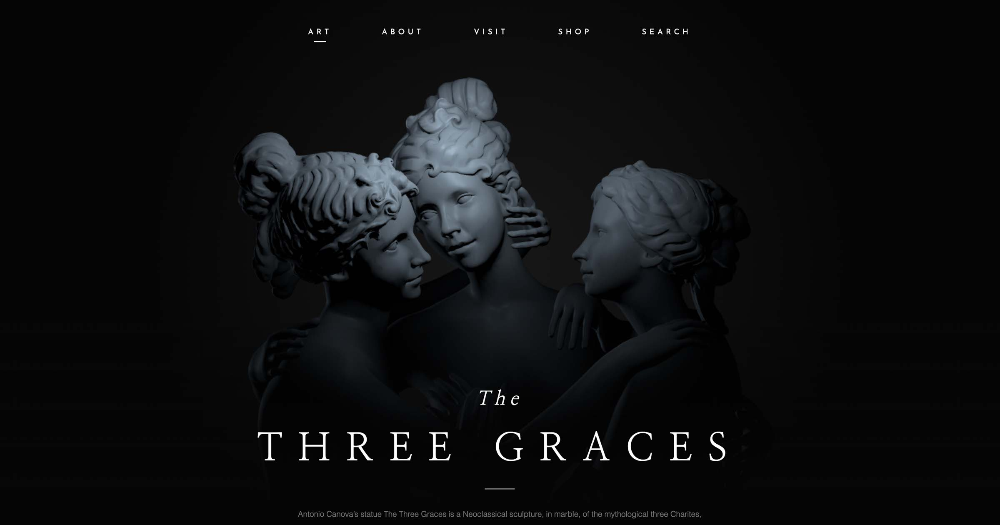

# Abdul Rafay Graces Design Concept using Three.js
<h4>by Abdul Rafay</h4>

This project demonstrates that creating a fancy design with Three.js is not as difficult as it looks. It uses only 240 lines of code and is based on the original concept of "The Three Graces."

The project uses Three.js in vanilla JavaScript with Webpack and is easy to understand for those not familiar with React Fiber yet.

## Getting Started
1. Install Node.js on your computer.
2. Open VSCode and load the project folder.
3. Install dependencies (only required the first time):

npm install

4. Run a local server at `localhost:8080`:
npm run dev

## Notes
If you find this project useful, feel free to support by giving a star or other ways you prefer. Your support helps create more Three.js content.